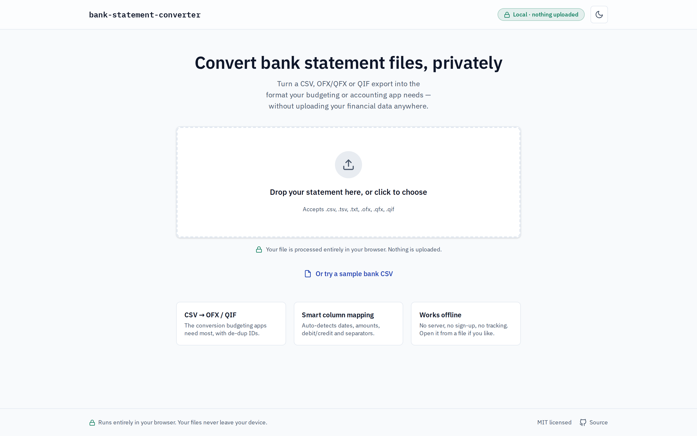
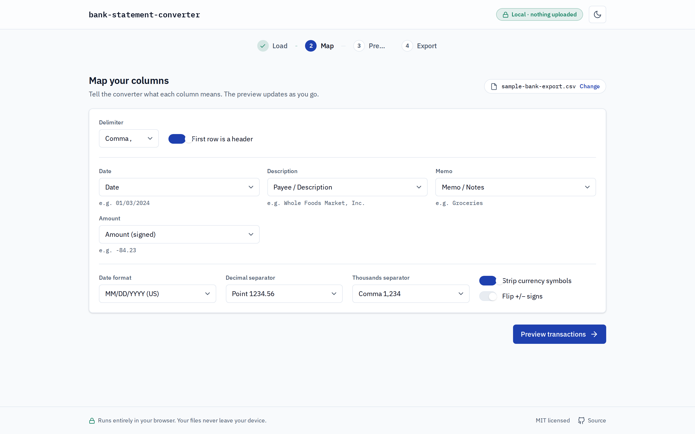
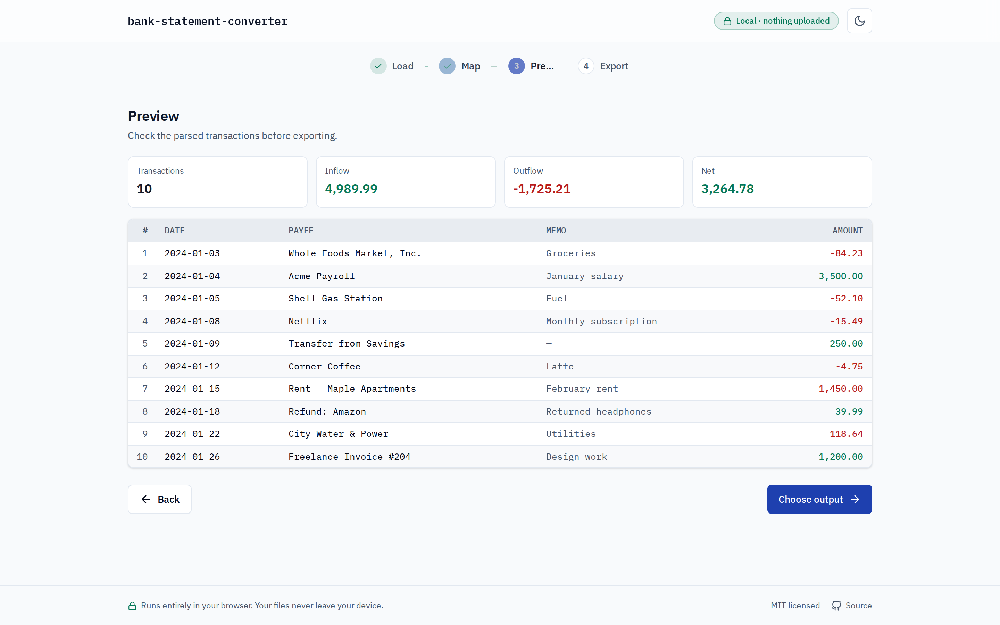
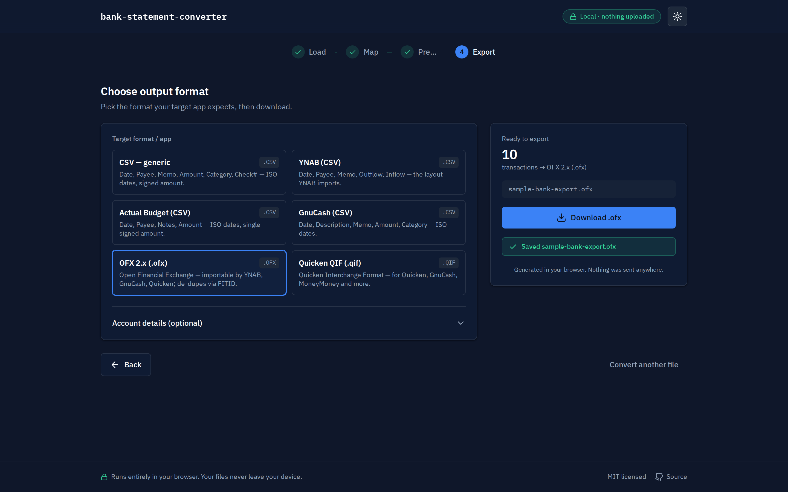

# bank-statement-converter

**Convert bank statement export files (CSV, OFX/QFX, QIF) between formats entirely in your browser — nothing is uploaded.**

Banks export your transactions as a CSV, OFX/QFX or QIF file. Your budgeting or
accounting app (YNAB, Actual Budget, GnuCash, Quicken, MoneyMoney…) wants a
*different* format — or the same one with the dates in a different order, one
signed amount column instead of separate debit/credit columns, no currency
symbols, the payee in the right field. The easy online converters that fix this
make you **upload your entire financial history to a stranger's server**.

`bank-statement-converter` does it **100% in your browser**. Your file is read
with the File API, transformed in memory, and saved back with a download — it
never touches a network. No upload, no sign-up, no tracking, works offline.



## Who it's for

Privacy-conscious people (and bookkeepers handling clients' data) who need to
get a bank export into the format their finance app expects, and who don't want
to hand transaction data to an anonymous website. Also: plain-text-accounting
and self-hosting folks who want an auditable, offline tool.

## Features

- **Any direction between CSV ⇄ OFX/QFX ⇄ QIF.** The headline path is
  **CSV → OFX/QIF** (what budgeting apps want, with `FITID`s so they de-dup on
  import), plus OFX/QIF → CSV and everything in between.
- **Smart auto-detection.** Detects the file format, and for CSV the delimiter
  (`, ; tab |`), header row, and decimal separator, then guesses which column is
  the date / payee / memo / amount (or debit & credit).
- **Full control when you need it.** Map each column by hand, pick the date
  format (with an ambiguity warning for `03/04`-style dates), set decimal &
  thousands separators, strip currency symbols, flip signs, and combine
  separate debit/credit columns into one signed amount.
- **Live preview** with running totals (inflow / outflow / net) and per-row
  parsing warnings you can filter to.
- **Per-app output presets:** YNAB, Actual Budget, GnuCash (CSV), generic CSV,
  OFX 2.x, and Quicken QIF — plus optional OFX account metadata.
- **Private & offline by design.** Zero network requests at runtime (verified —
  see [`review/network-audit.json`](review/network-audit.json)). Self-hosted
  fonts. Runs from GitHub Pages, a downloaded `.zip`, or even `file://`.
- Accessible (WCAG 2.1 AA — axe-clean in light & dark), responsive, keyboard-
  navigable, `prefers-reduced-motion` aware.

## Screenshots

| Map columns | Preview | Export (dark) |
|---|---|---|
|  |  |  |

## Use it

### Online
A live build is published via GitHub Pages — see the repository's **About**
link. Open it, drop in your file, and convert.

### Download & run locally (fully offline)
1. Grab `bank-statement-converter-dist.zip` from the
   [latest release](https://github.com/Skytuhua/bank-statement-converter/releases/latest).
2. Unzip it and open `index.html` in any modern browser. That's it — no server
   needed, and it works with no internet connection.

### How to convert (60 seconds)
1. **Load** your bank file (drag-and-drop or click). Don't have one? Click
   *"Or try a sample bank CSV"*.
2. **Map** the columns — they're auto-detected, so usually just confirm. Adjust
   the date format / separators if the preview looks off.
3. **Preview** the parsed transactions and totals.
4. **Export** — pick your target app/format and download.

## Build from source

Requirements: Node 20+.

```bash
git clone https://github.com/Skytuhua/bank-statement-converter.git
cd bank-statement-converter
npm install

npm run dev      # start the dev server
npm run build    # produce the static site in dist/
npm run preview  # serve the production build
npm test         # run the test suite (198 tests)
npm run lint     # lint
```

The build in `dist/` is a self-contained static site (relative asset paths), so
you can host it anywhere or open it from the filesystem.

## How it works

- **Pure core (`src/core/`)** — framework-free, fully unit-tested importers,
  exporters, and normalisers built around one canonical `Transaction` model.
  All conversion is in-memory data transformation.
- **React UI (`src/components/`, `src/state/`)** — a thin, stateful shell over
  that core; the live preview is derived with `useMemo`.
- No backend, no API, no telemetry. See
  [`ARCHITECTURE.md`](ARCHITECTURE.md) and [`SPEC.md`](SPEC.md) for details, and
  [`RESEARCH.md`](RESEARCH.md) for why this tool exists.

## Supported formats

| | Input | Output |
|---|:---:|:---:|
| CSV (any delimiter) | ✅ | ✅ |
| OFX 1.x (SGML) | ✅ | — |
| OFX 2.x (XML) | ✅ | ✅ |
| QFX | ✅ | (as OFX) |
| QIF | ✅ | ✅ |

## Limitations

- No PDF statement parsing / OCR — input is delimited/financial *export* files,
  not scanned statements.
- Single file in → single file out (no multi-file merging).
- No live bank connections (no OAuth/Plaid), no cloud sync.
- Scientific-notation amounts (`1e3`) aren't interpreted as 1000 (bank exports
  don't use them).

## Privacy

Your financial data is processed entirely on your device and is **never
uploaded**. There are no analytics, no cookies, and no network requests at
runtime — a Playwright audit of the full flow recorded **zero** external
requests ([`review/network-audit.json`](review/network-audit.json)).

## License

[MIT](LICENSE) © Skytuhua
